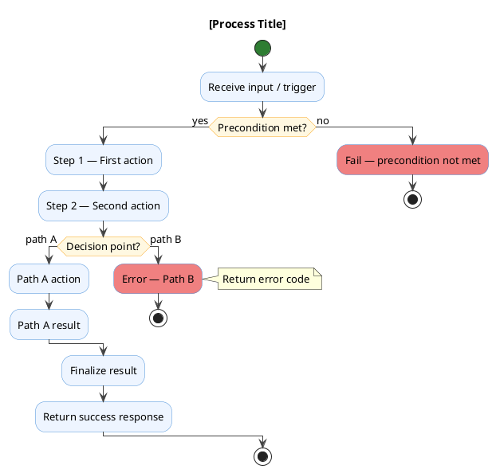
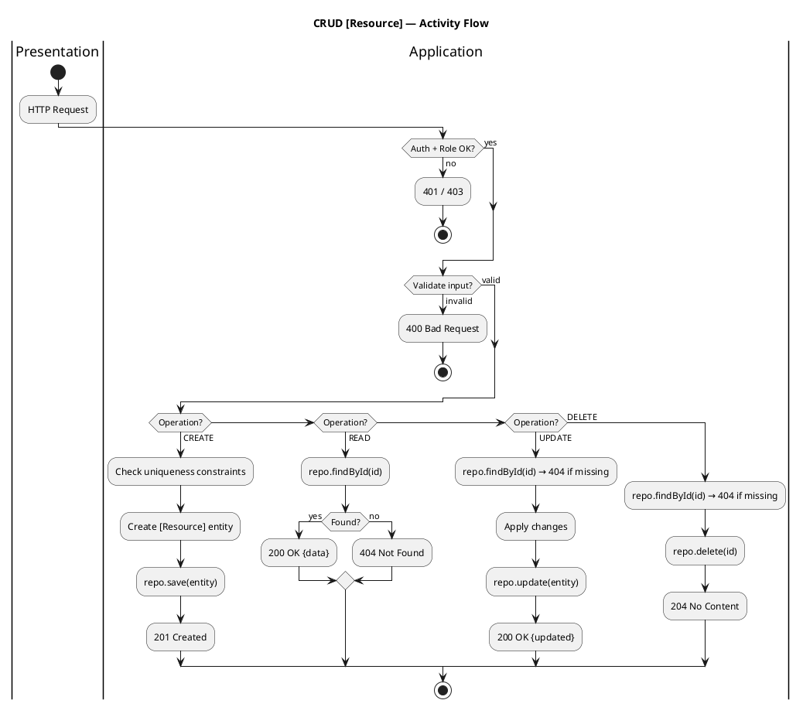

# PlantUML Activity Diagram

Generate a PlantUML activity diagram for: **$ARGUMENTS**

Read `.claude/resources/plantuml-syntax.md` — section **3. Activity Diagrams** — for syntax reference.

---

## Template



---

## HTTP Request Pipeline Template

For API request handling flows (most common use in this project):

```plantuml
@startuml [endpoint]-activity
skinparam shadowing false
skinparam defaultFontName Helvetica
skinparam defaultFontSize 13

title [HTTP Method] /[path] — Activity

start

:Receive HTTP [METHOD] /[path];

:JWT middleware — verify Bearer token;
if (Token valid?) then (yes)
else (no)
  #LightCoral:401 Unauthorized;
  stop
end if

if (Method requires ADMIN?) then (yes)
  :Role middleware — check user.role;
  if (Role == ADMIN?) then (yes)
  else (no)
    #LightCoral:403 Forbidden;
    stop
  end if
else (no — public read)
end if

:Controller — parse & validate Zod schema;
if (Body valid?) then (yes)
else (no)
  #LightCoral:400 Bad Request {errors};
  stop
end if

:Resolve use case from DI container;
:Execute use case (domain logic);

if (Domain error?) then (no)
  :Map result to response DTO;
  #LightGreen:200/201 OK {data};
else (yes)
  if (NotFoundError?) then (yes)
    #LightCoral:404 Not Found;
  else (ConflictError?)
    #LightCoral:409 Conflict;
  else (other domain error)
    #LightCoral:422 / 400 Business rule violation;
  end if
end if

stop
@enduml
```

---

## Rules

1. **Start with `start`, end with `stop`** — every activity diagram must have both.
2. **Use `:action;` syntax** — every action block ends with semicolon.
3. **Label every decision branch** — `if (condition?) then (label)` and `else (label)`.
4. **Multi-branch decisions use `elseif`** — NEVER use multiple `else` in one `if` block. Use `elseif (cond?) then (label)` for each additional branch; only the final fallback uses `else (label)`.
5. **Color error paths** — use `#LightCoral:error message;` for failure exits.
6. **Color success paths** — use `#LightGreen:success message;` for happy path exits.
7. **Use `note right`** for business rule explanations, not for obvious steps.
8. **Swim lanes for multi-actor flows** — use `|Actor Name|` partition syntax:
   ```plantuml
   |Client|
   :Send request;
   |API Server|
   :Process request;
   |Database|
   :Execute query;
   ```
8. **`split` is for CONCURRENT parallel flows only** — NEVER nest `split / split again / end split` inside an `if / else / endif` block. PlantUML forbids this combination and produces a syntax error. For mutually exclusive user choices (e.g. export options), always use `if / elseif / else / endif` chains instead.
9. **Use `fork / fork again / end fork`** for parallel operations that happen at the same time.
10. **Keep diagrams focused** — one process per diagram. Split complex flows into sub-processes.
10. **Loops** — use `while (condition?) is (yes) ... end while` or `repeat ... repeat while (condition?)`.

---

## CRUD Template

Quick template for standard CRUD activity:



---

## Output

Produce a complete, renderable `.puml` file starting with `@startuml` and ending with `@enduml`.

State the suggested save path: `diagrams/flows/[activity-name].puml`

Then write the file to that path.
