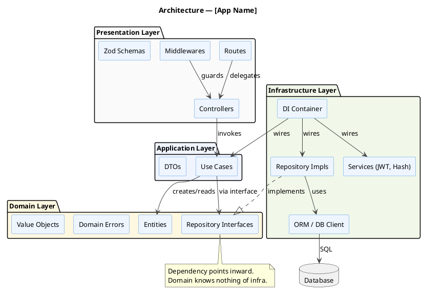
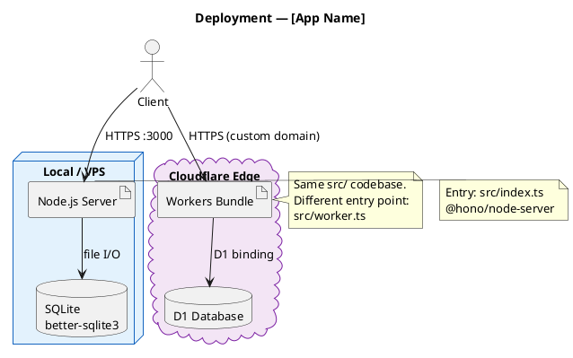

# PlantUML Architecture Diagram

Generate a PlantUML architecture diagram for: **$ARGUMENTS**

Read `.claude/resources/plantuml-syntax.md` — sections **1. Architecture / Component Diagrams** and **5. Style Tips** — for syntax reference.

---

## Decision: Component vs Deployment

Choose the diagram type based on the input:

| Input mentions | Use |
|----------------|-----|
| Layers, modules, services, components, data flow | **Component diagram** (`package`, `component`, `-->`) |
| Servers, nodes, runtimes, cloud providers, deploy targets | **Deployment diagram** (`node`, `cloud`, `artifact`) |
| Both | Two separate `@startuml` blocks or composite with both |

---

## Component Diagram Template

Use for Clean Architecture layers, service boundaries, internal module structure.



## Deployment Diagram Template

Use for node topology, cloud providers, runtime environments.



---

## Rules

0. **Always add `!pragma layout smetana`** as the first line after `@startuml` in every component and deployment diagram. Component diagrams require Graphviz (`dot`) by default; without this pragma PlantUML crashes with `Cannot run program "dot"` when Graphviz is not installed. Smetana is PlantUML's built-in pure-Java layout engine and has no external dependencies.
1. **Group by logical boundary** — use `package` for layers/services, `node` for runtime hosts.
2. **Label arrows** — every `-->` must describe the relationship (uses, calls, implements, queries).
3. **One diagram = one concern** — if both component + deployment are needed, create two files.
4. **No implementation details** — diagram shows structure, not code. Class names, not method names.
5. **Dependency rule visible** — outer layers arrow toward inner (Presentation → Application → Domain). Never reverse.
6. **Add a title** — always include `title` directive.
7. **Note strategic decisions** — use `note` for architectural constraints (e.g., "Domain knows nothing of infra").
8. **Never use `note right of` or inline `note` on components inside a `package` block.** Smetana does not support notes anchored to components that live inside packages — they cause rendering errors or invisible output. Place all notes **outside** any `package` block as standalone `note bottom of [Component] ... end note` directives.

---

## Output

Produce a complete, renderable `.puml` file:

```
@startuml [diagram-id]
' ... diagram content ...
@enduml
```

State the suggested save path:
- Component: `diagrams/architecture/[name].puml`
- Deployment: `diagrams/architecture/deployment.puml`

Then write the file to that path.
