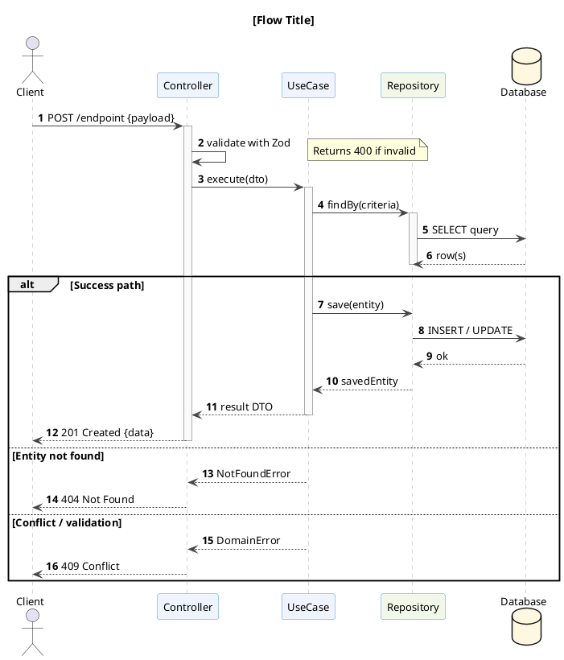

# PlantUML Sequence Diagram

Generate a PlantUML sequence diagram for: **$ARGUMENTS**

Read `.claude/resources/plantuml-syntax.md` — section **2. Sequence Diagrams** — for syntax reference.

---

## Template



---

## Rules

1. **Always use `autonumber`** — step numbers make flows readable.
2. **`activate` / `deactivate` every participant** — shows lifeline scope clearly.
3. **Name every arrow** — `->` and `-->` must always have a label describing the message.
4. **Solid arrows for calls, dashed for replies** — `A -> B : call` / `B --> A : reply`.
5. **Use `alt / else / end`** for all branching paths — never omit error paths.
6. **Use `loop` for repeated operations** — e.g., retry, batch processing.
7. **Add `note` for non-obvious decisions** — middleware checks, hashing, token rotation.
8. **Keep participants minimal** — only show the actors/participants relevant to this specific flow.
9. **Activate scope matches work** — activate on entry, deactivate on response returned.
10. **Use `box` grouping** for multi-service flows:
    ```plantuml
    box "API Server" #EEF5FF
      participant Controller
      participant UseCase
    end box
    box "Storage" #F1F8E9
      participant Repository
      database DB
    end box
    ```

---

## Auth-Specific Additions

For authentication/JWT flows, include these participants and notes:

```plantuml
participant "JwtMiddleware" as JWT #FFE0B2
participant "HashService" as HASH #F3E5F5
participant "TokenService" as TOKEN #E8F5E9

note over JWT : Verifies Bearer token\nRejects with 401 if invalid
note over TOKEN : signAccessToken (15 min)\nsignRefreshToken (7 days, jti=UUID)
note over HASH : bcrypt.compare for passwords\nSHA-256 for refresh token DB lookup
```

---

## Output

Produce a complete, renderable `.puml` file starting with `@startuml` and ending with `@enduml`.

State the suggested save path: `diagrams/flows/[flow-name].puml`

Then write the file to that path.
