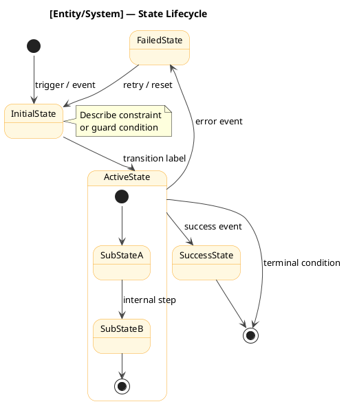
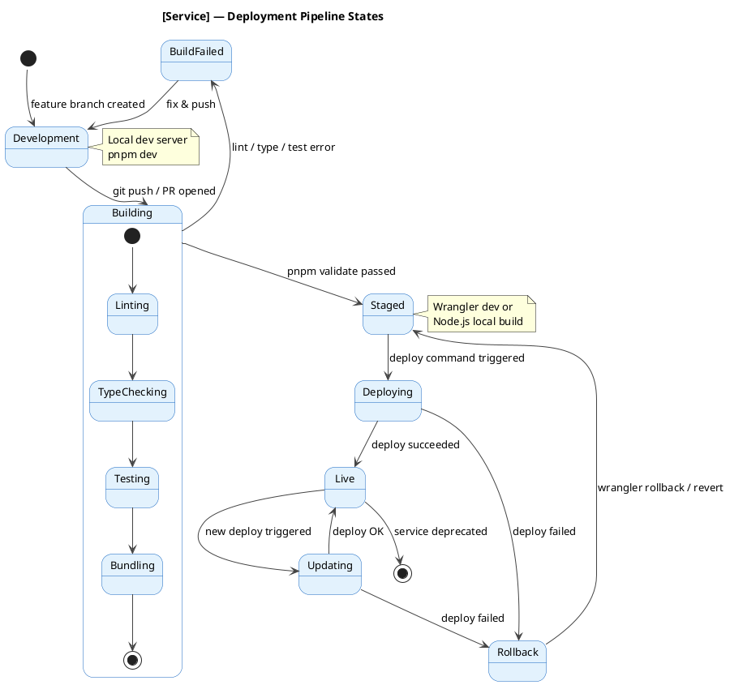
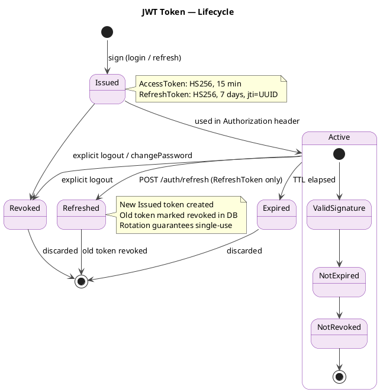
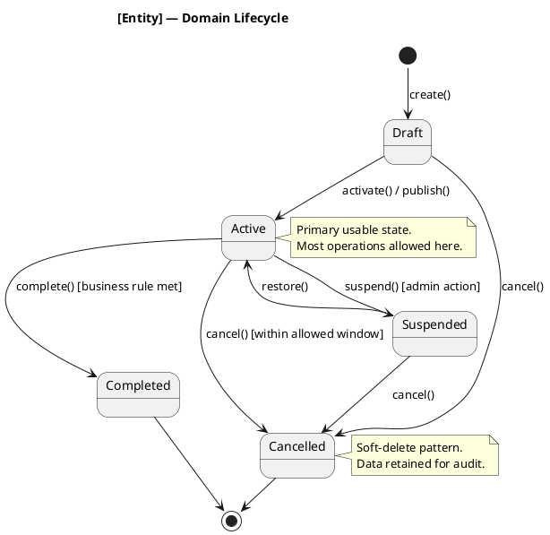

# PlantUML State Diagram

Generate a PlantUML state diagram for: **$ARGUMENTS**

Read `.claude/resources/plantuml-syntax.md` — section **4. State Diagrams** — for syntax reference.

---

## Template



---

## CI/CD Pipeline Template

For deployment pipeline state machines:



---

## Token Lifecycle Template

For JWT or session token state machines:



---

## Entity Lifecycle Template

For domain entity state machines (order, product, user, etc.):



---

## Rules

0. **Always add `!pragma layout smetana`** as the second line (right after `@startuml`) in every state diagram. State diagrams use Graphviz (`dot`) by default; without this pragma PlantUML crashes with `Cannot run program "dot"` when Graphviz is not installed. Smetana is PlantUML's built-in pure-Java layout engine with no external dependencies.
1. **Always start with `[*]`** — initial pseudo-state must be the entry point.
2. **Keep transition labels short — one line only.** Never embed `\n` or multi-line text in arrow labels (`StateA --> StateB : long text\nmore text`). Long labels cause text overlap and unreadable diagrams with Smetana. Move details to a `note right of StateName` block instead.
3. **Never place `note` blocks inside `state { }` composite blocks.** The syntax `state X { note : text }` is not supported by Smetana and produces garbled output. Always use external notes: `note right of X ... end note`.
2. **Always have at least one `State --> [*]`** — every state machine needs terminal states.
3. **Label every transition** — `StateA --> StateB : event [guard] / action`.
4. **Use composite states for sub-flows** — `state Name { ... }` for states with internal steps.
5. **Add notes for constraints** — `note right of StateName : guard or business rule`.
6. **Color terminal states** — success states green `#LightGreen`, failure/cancelled states red `#LightCoral`.
7. **Keep transitions unidirectional unless explicitly bidirectional** — avoid visual clutter.
8. **Name the diagram after the entity or process** — `@startuml jwt-token-lifecycle`.
9. **Separate concerns** — one state machine per entity/token/pipeline. Don't mix token + deployment.
10. **Parallel regions** for concurrent sub-states:
    ```plantuml
    state Processing {
      [*] --> EmailVerification
      --
      [*] --> PaymentValidation
    }
    ```

---

## Output

Produce a complete, renderable `.puml` file starting with `@startuml` and ending with `@enduml`.

State the suggested save path: `diagrams/states/[state-name].puml`

Then write the file to that path.
