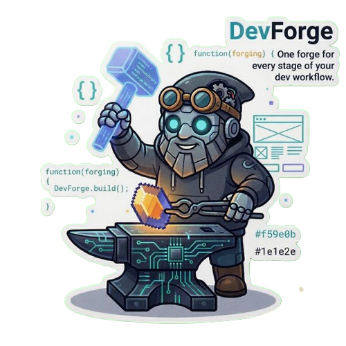

<p align="center">
  
</p>

[](https://github.com/GustavoGutierrez/devforge-mcp)
[](LICENSE)
[](https://golang.org)
[](https://modelcontextprotocol.io)
[](https://github.com/GustavoGutierrez/devforge-mcp)
[](https://github.com/GustavoGutierrez/devforge-mcp)

# DevForge MCP

**"One forge for every stage of your dev workflow."**

DevForge MCP is a Go-based MCP server that acts as a transversal intelligence layer and utility toolkit across the software development lifecycle. It exposes a rich set of tools — for code, architecture, design, media processing, and documentation — through the MCP stdio transport, making it accessible to any MCP-compatible AI client.

Built around a SQLite-backed pattern store with FTS5 search and optional vector embeddings, it provides specialized skills and sub-agents that work together to reduce friction at every phase: from initial architecture decisions to production-ready interfaces and optimized media assets.

> **Multimedia engine:** All image, video, and audio processing is powered by [DevPixelForge](https://github.com/GustavoGutierrez/devpixelforge), a Rust-based processing engine that ships as a pre-built binary alongside DevForge.

## Key Capabilities

- **Multimedia optimization** — Compress and convert images, video, and audio for the web using the DevPixelForge Rust engine (with FFmpeg).
- **Design system management** — Store, search, and retrieve UI patterns, design tokens, color palettes, and architecture diagrams.
- **Layout analysis & generation** — Audit existing layouts and generate new ones adapted to any supported frontend stack.
- **MCP tool surface** — Works as an MCP server so any AI client (Claude, OpenCode, Copilot, etc.) can invoke its tools via stdio.
- **CLI/TUI companion** — A Bubble Tea-based terminal interface for browsing patterns, launching audits, and configuring integrations without leaving the terminal.
- **Specialized skills** — Extends capabilities through configurable skills and sub-agents for frontend, backend, architecture, documentation, and QA.
- **Cross-stack** — A common tool for frontend, backend, infrastructure, and automation.

## Current Frontend Stack Support

The UI and design tools adapt their output to the declared stack:

- Vanilla JS/TS + modern CSS SPA (Vite 8).
- Astro, Next.js, SvelteKit, Nuxt.js.
- Tailwind CSS v4+ with the official Vite plugin:
  - Importing `@import "tailwindcss";` in a single CSS file.
  - Design tokens in CSS instead of `tailwind.config.js`.

## Components

- `cmd/devforge-mcp/`
  - Go MCP server with SQLite/FTS5, optionally libSQL.
  - Current tools:
    - **UI/Design**: `analyze_layout`, `suggest_layout`, `manage_tokens`, `store_pattern`, `list_patterns`, `suggest_color_palettes`
    - **Images**: `optimize_images`, `generate_favicon`, `generate_ui_image` (requires Gemini API key)
    - **Video**: `video_transcode`, `video_resize`, `video_trim`, `video_thumbnail`, `video_profile`
    - **Audio**: `audio_transcode`, `audio_trim`, `audio_normalize`, `audio_silence_trim`
    - **Config**: `configure_gemini`, `ui2md`

- `cmd/devforge/`
  - Go CLI/TUI built with Bubble Tea for:
    - Browsing patterns and architectures.
    - Launching layout audits.
    - Generating layouts, images, and favicons.
    - Processing video and audio.
    - Exploring color palettes.
    - Configuring integrations (Gemini API key, etc.) from the Settings view.

- `db/devforge.db`
  - SQLite with tables for:
    - `patterns`, `architectures`, `tokens`, `audits`, `assets`, `palettes`.
  - FTS5 virtual tables for efficient full-text search.

- `internal/dpf/`
  - Go bridge to the DevPixelForge Rust multimedia processing engine.
  - Binary: `bin/dpf`.
  - Supports: images (resize, optimize, convert, favicon), video (transcode, resize, trim, thumbnail, profile), audio (transcode, trim, normalize, silence_trim).
  - Requires FFmpeg for video/audio operations.
  - See [`internal/dpf/INTEGRATION.md`](internal/dpf/INTEGRATION.md).

## Configuration

Shared config file between the MCP server and the CLI:

```
~/.config/devforge/config.json
```

Override with the `DEV_FORGE_CONFIG` environment variable.

## Installation

### Via Homebrew (Linux & macOS)

Install all three components — `devforge` (CLI/TUI), `devforge-mcp` (MCP server), and `dpf` (media engine):

```bash
# Option 1 — Direct URL (recommended, works immediately)
brew install https://raw.githubusercontent.com/GustavoGutierrez/devforge-mcp/homebrew-tap/Formula/devforge.rb

# Option 2 — Clone the tap first, then install
# (The repo is named devforge-mcp, not homebrew-devforge, so --custom-remote is required)
brew tap --custom-remote gustavogutierrez/devforge https://github.com/GustavoGutierrez/devforge-mcp homebrew-tap
brew install devforge
```

> **Note:** The `--custom-remote` flag is needed because Homebrew's standard tap convention expects `homebrew-{name}/` directories, but this repo uses `homebrew-tap/` for the formula branch.

See the [DevForge Homebrew Tap README](homebrew-tap/README.md) for full post-install setup and troubleshooting.

### From Source

Build from source with Go 1.24+:

```bash
# Clone the repository
git clone https://github.com/GustavoGutierrez/devforge-mcp.git
cd devforge-mcp

# Build all components (requires CGO)
CGO_ENABLED=1 go build ./...

# Ensure the media processing binary is executable
chmod +x bin/dpf

# Run the MCP server
./devforge-mcp

# Or run the CLI/TUI
./devforge
```

For detailed setup instructions, see [docs/install.md](docs/install.md).

## System Requirements

- **Go 1.24+** with CGO enabled (`CGO_ENABLED=1`)
- **FFmpeg 6.0+** (for video/audio operations)
- **Rust toolchain** (only if recompiling the `dpf` binary from [DevPixelForge](https://github.com/GustavoGutierrez/devpixelforge))
- **Linux**: Ubuntu 22.04+ (for Homebrew bottles; building from source works on any glibc 2.17+)
- **macOS**: 12+ (Monterey or later)

## Documentation

| Doc | Description |
|-----|-------------|
| [docs/install.md](docs/install.md) | Full installation guide: build, install, configure, run |
| [docs/mcp-connect.md](docs/mcp-connect.md) | Connect DevForge to VS Code, Claude Desktop, Claude Code, OpenCode |
| [docs/cli-tui.md](docs/cli-tui.md) | CLI/TUI usage guide |
| [docs/overview.md](docs/overview.md) | High-level project overview |
| [docs/schema.md](docs/schema.md) | Database schema reference |
| [internal/dpf/INTEGRATION.md](internal/dpf/INTEGRATION.md) | How to integrate DevPixelForge into any Go project |
| [scripts/README.md](scripts/README.md) | Script reference for install, seed, and setup |
